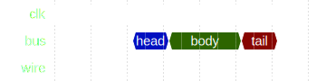
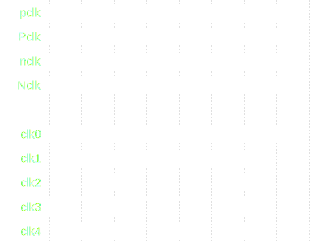

# clkdiv
## Basic Info
- 3 params, 0 ports 
- top module √ 

## params
no params info

## ports
| name | type | width | description |
| :--- | :--- | :--- | :--- |
| clk50 | input | 1 | |
| rst_n | input | 1 | |
| clkout | output | 1 | |

## Dependency
no Dependencies info

 
</img>
  

 
</img>
  

